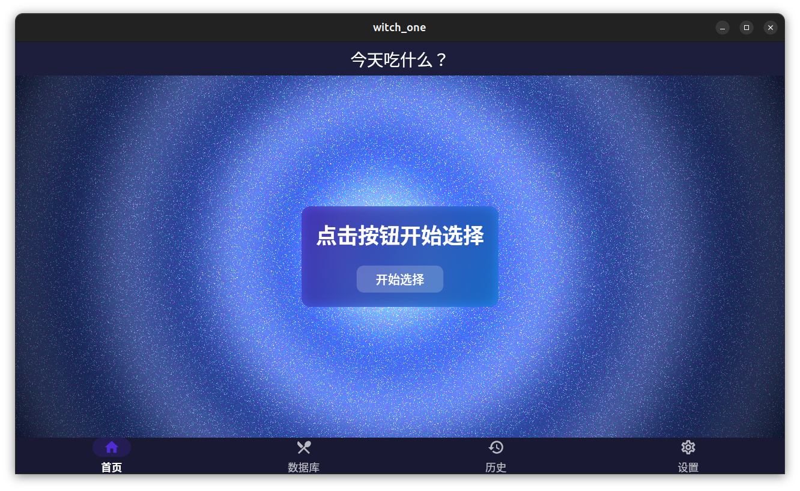
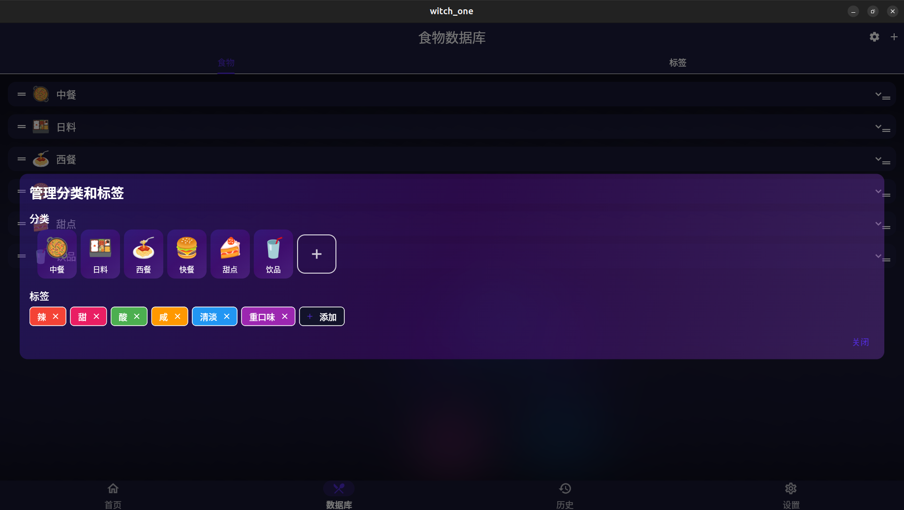
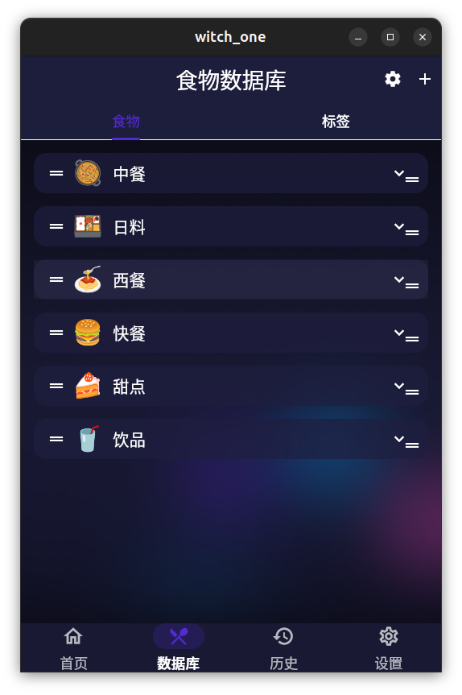
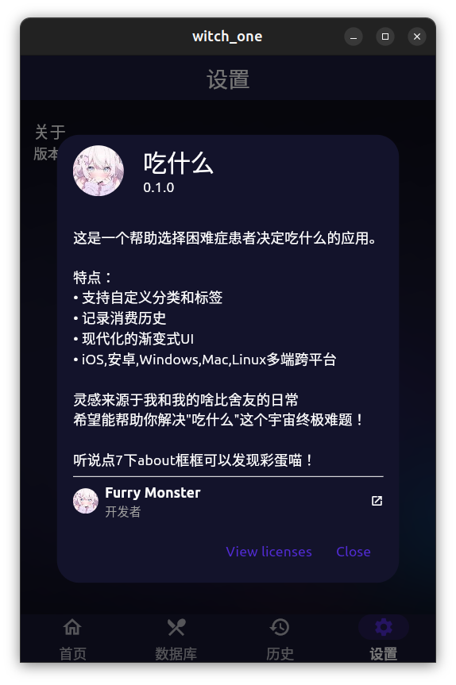

# 吃什么 (what to eat)

一个帮助你解决"吃什么"这个终极难题的 Flutter 应用。

## ✨ 特性

- 🎲 智能随机选择
- 📝 自定义分类和标签管理
- 🎨 现代化渐变式 UI
- 🌈 流体动画背景
- 📱 跨平台支持 (iOS, Android, Windows, Mac, Linux)

## 🖼️ 截图










## 🚀 编译源代码使用（不推荐）

1. 克隆仓库

```bash
git clone https://github.com/Furry-Monster/witch_one.git
```

2. 安装依赖

```bash
flutter pub get
```

3. 运行应用

```bash
flutter run
```

## 🛠️ 技术栈

- Flutter 3.x
- Dart 3.x
- GLSL 着色器
- SharedPreferences 本地存储

## 📦 依赖

- shared_preferences: ^2.2.2
- path_provider: ^2.1.2
- package_info_plus: ^4.2.0
- cached_network_image: ^3.3.1
- url_launcher: ^6.2.5

## 🎨 设计特点

- 流体动画背景
- 磨砂玻璃效果
- 动态渐变
- 响应式布局
- 深色主题支持

## 🤝 贡献

欢迎提交 Issue 和 Pull Request！

## 💡 灵感来源

灵感来源于我和我的啥比舍友的日常 —— 每天都在问"今天吃什么"这个终极难题。

## 🎮 彩蛋

试试在关于页面点击 7 次 about 框框？

## 📄 许可

MIT License

## 👨‍💻 作者

Furry Monster

## 🔗 链接

- GitHub: [https://github.com/Furry-Monster](https://github.com/Furry-Monster)
- 问题反馈: [https://github.com/Furry-Monster/witch_one/issues](https://github.com/Furry-Monster/witch_one/issues)

## 🙏 致谢

感谢每天两个人出去不知道吃什么从而为我提供灵感的室友！

## 📝 更新日志

### v0.1.0

- 初始版本发布
- 基础功能实现
- 流体动画背景
- 跨平台支持
